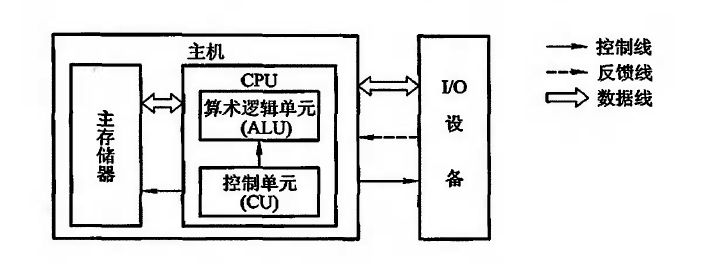

# 计算机系统概论

## 系统简介

### 软硬件概念

计算机分为

* 硬件：计算机的实体部分
* 软件：具有各种特殊功能的程序

	* 系统软件：管理整个计算机系统
	* 应用软件：按任务需要编制的各种程序

### 层次结构

* 高级语言机器M4，高级语言程序翻译为汇编语言程序，虚拟机器
* 汇编语言机器M3，汇编语言程序翻译为机器语言程序，虚拟机器
* 操作系统机器M2，用机器语言解释操作系统，管理计算机软硬件，虚拟机器
* 机器语言机器M1，微程序解释机器指令，传统机器
* 微指令系统M0，由硬件直接执行微指令，微程序机器

一条汇编语言对应了一条机器语言

操作系统提供了汇编语言和高级语言的使用过程中所需的一些基本操作，还起到控制并管理计算机软硬件资源的作用

从高级语言翻译为机器语言的软件称为翻译程序，分为两种

* 编译程序：一次全部翻译为机器语言程序后，再进行执行
* 解释程序：翻译一句，执行一句。即使下次重复遇到此语句，也必须重新翻译

硬件的主要研究对象为M0和M1，软件的主要研究对象为操作系统以上的各级虚拟机。如M4向上还可构建应用语言虚拟机，应用语言编写的程序一般由应用程序包翻译到虚拟机器M4上，使得计算机可以满足某种功能

### 概念区分

#### 计算机组成

实现计算机体系结构所体现的属性

具体指令的实现，包含了很多对程序员来说是透明的硬件细节

#### 计算机体系结构

计算机体系结构指能够被程序员见到的计算机系统的属性，**概念性**结构与**功能特性**

指令系统、数据类型、寻址技术、IO机理等，不同层次的程序员所看到的计算机属性时不一样的

个人理解，体系结构是API的对外，计算机组成是API的实现细节

## 基本组成

### 硬件框图

冯诺依曼计算机分为五大部分运算器ALU、控制器CU、存储器、输入设备和输出设备

计算机在由**以运算器为核心发展为以存储器为核心**

在超大规模集成电路技术帮助下，运算器（ALU）和控制器（CU）已经合并为CPU

目前计算机分为三大部分，CPU、IO设备和主内存器main memory。CPU+main memory称为主机，IO设备称为外部设备

#### 系统复杂性管理

* 层次化（Hierarchy）：将系统划分为多个模块或子模块
* 模块化（Modularity）：有明确定义的功能和接口
* 规律性（Regularity）：接口更容易被复用

### 计算机工作步骤

现实中判断问题如何使用计算机解决

1. 是否能够通过计算机解决：**可计算性研究**
1. 建立数学模型
1. 确定计算方法
1. 编制解题程序：将运算步骤用一一对应的机器指令描述

	指令为操作码 + 操作数地址码

#### 主存储器

存储体 -> 存储单元 -> 存储元件

* 存储单元：存放一串二进制代码
* 存储字：存储单元中二进制代码的组合
* 存储字长：存储单元中二进制代码的长度

按地址访问：每个存储单元有一个唯一的地址，可以按地址访问

* MAR：Memory Address Register，存储器地址寄存器，存放待访问的存储单元的地址，其位数对应存储单元的个数
* MDR：Memory Data Register，存储器数据寄存器。存放从Memory中取出的data或准备向Memory中存入的data，位数与存储字长相同

#### 运算器

运算器至少包括三个寄存器和一个算术逻辑单元ALU

* ACC：累加器
* MQ：乘商寄存器
* X：操作器寄存器

#### 控制器

完成一条指令的三个阶段

1. 取指阶段
1. 分析阶段
1. 执行阶段

控制器由三部分组成
* 程序计数器Program Counter：存放当前待执行指令的地址，与MAR交互。可以自动+1，准备下一次取指
* 指令寄存器Instruction Register：存放当前指令。操作码送到CU分析指令，地址码送到MAR
* 控制器CU：分析当前指令所需的操作，发出微操作命令

#### IO

IO子系统包括各种IO设备及其相应的接口

## 硬件主要技术指标

### 机器字长

CPU一次能处理的数据位数，与CPU中寄存器位数有关。

机器字长直接影响ALU、数据总线和存储字长的位数

### 存储容量

### 运算速度

运算速度受到主频和内核数的影响

运算速度的定量测量

* 吉普森法：考虑每条指令的使用频率
* MIPS：Million Instruction Per Second，百万条指令每秒，表示单位时间执行指令的平均条数
* CPI：Cycle Per Instruction，执行一条指令所需的时钟周期
* FLOPS：Floating Point Operation Per Second，浮点运算次数每秒

## QA：

### 指令和数据都存于存储器中，计算机如何区分

* 通过不同的时间段进行区分。即取指阶段取出的为指令，执行阶段取出的为数据
* 通过地址来源进行区分。由PC提供的地址取出的是指令，由IR提供地址取出的是操作数，即数据