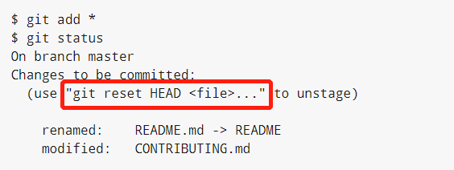

# git基础

## 获取repo

### 初始化repo

* `git init`：创建一个名为`.git`的目录，git仓库的核心
* `git add`：实现对指定文件的暂存
* `git commit`：提交

### clone repo

git克隆的是该git仓库服务器桑的几乎所有数据，**默认配置下远程Git仓库中的每一个文件的每一个版本都将会被拉取下来**，而不是仅复制完成工作所需的文件。如果服务器上磁盘坏掉了，也可以通过任何一个用户端重建服务器上的仓库

`git clone [url]`

git支持多种数据传输协议，包括
* `https`协议
* `git://`协议
* `SSH`传输协议

详见[在服务器上搭建git](https://www.progit.cn/#_git_on_the_server)

## 文件的生命周期


### `git status`

检查当前文件状态，该命令会列出当前目录下
* 已跟踪但被修改的文件
* 未跟踪状态的新文件
* 当前所在的分支
* 当前分支与远程分支是否存在偏离

`git status`命令的输出比较详细，使用`git status -s | --short`命令输出较为简短

### `git add`

git add [filename | .]

该命令会跟踪新文件或者暂存已修改的文件

### `.gitignore`

配置需要git忽略的文件，支持正则匹配

### `git diff`

可以详细查看已暂存和未暂存的修改

* git diff：默认只显示工作区修改
* git diff --cached | --staged：显示暂存区修改

### `git commit`

将已暂存的文件提交更新

为防止有遗漏的文件，建议每次提交前，先用git status查看文件是不是都已经暂存，然后再进行commit

**提交时的记录是放在暂存区域的快照**。每一次提交操作，都是对项目做一次快照，以后可以回到这个状态，或者进行比较

* git commit：基础命令
* git commit -m [message]：将message放在命令行中
* git commit -a -m [message]：跳过暂存区域，自动将所有已跟踪的文件暂存并提交，**注意未跟踪文件，如新建的文件不会被暂存和提交**

### `git rm`

从git中移除文件，必须要从暂存区移除，然后提交，此处可以用到`git rm`命令完成，并且可以顺带从工作目录中删除指定文件

如果需要删除已经修改过且添加到暂存区的文件，需要增加`-f`参数，强制删除

`rm`与`git rm`区别
* `rm`：从工作区删除文件，但并未从暂存区移除，如果想要恢复，需要将工作区该文件的修改丢弃`git checkout -- filename`
* `git rm`：工作区+暂存区删除文件，恢复需要丢弃暂存区该文件修改，即将该文件从暂存区恢复到工作区 + 丢弃工作区修改

### `git mv`

进行文件的重命名，相当于
* mv file1 file2
* git rm file1
* git add file2

## 查看提交历史

git log可以查看提交历史

options
* -p：展示每次提交的内容差异
* --stat：展示简略的统计信息
* --pretty=[option]：指定使用不同的格式展示提交历史，其中format可以自定义格式
* --graph：使用图形象展示commit之间关系，与pretty搭配使用
* -[num]：限制显示条数
* 其他一些筛选条件
* -- filePath：指定文件路径

## 撤销操作

### 重新提交

`git commit --amend`
* 将暂存区文件提交
* 将本次提交与上次提交合并，并覆盖上次message

### 取消暂存

`git reset HEAD <file>`可以将暂存区的修改回退到工作区



**NOTE**：git reset命令的hard选项很危险，可能会导致工作目录所有当前进度丢失，谨慎使用

### 撤掉对文件的修改

`git checkout -- [file]`：撤销工作区为文件的修改

同样可以在git status输出中查看该命令

**NOTE**
* Git中任何已提交的东西几乎都是可以恢复的，包括被删除分支的提交或者amend覆盖的提交
* 但是未被提交的东西丢失后无法恢复

## 远程仓库的使用

Git通过远程仓库进行协作，远程仓库可以进行读写权限控制。

### 查看origin repo

`git remote`：查看已经配置的远程仓库服务器，默认情况下会列出他们的简写，至少会有一个origin，这是git clone仓库服务器的默认名字

* `git remote -v`：显示简写与其对应的URL
* `git remote add <shortname> <url>`：添加一个新的远程git仓库，并指定简写
* `git remote show [remote-name]`：列出远程仓库的URL和跟踪分支的信息
* `git remote rename [old-name] [new-name]`:重命名远程仓库
* `git remote rm [remote-name]`：移除特定远程仓库

### 从远程仓库抓取和拉取

#### `git fetch [remote-name]`

命令访问远程仓库，从中拉取所有本地没有的数据。执行完成后，将会拥有远程仓库中所有分支的引用，可以随时合并或查看

使用`git clone`克隆一个仓库后，命令会自动将其添加为远程仓库，并默认以`origin`为简写

`git fetch`会拉取clone或上一次fetch操作后新推送的所有工作，将数据拉取到本地仓库，但是**不会自动合并或修改当前的工作区**，必须手动进行合并

#### `git pull`

命令会自动拉取数据然后合并远程分支到当前分支

### 推送到远程仓库

`git push [remote-name] [branch-name]`

只有当前用户对clone的服务器有写入权限，并且之前没有人pull过，该命令才会生效

## tag

git可以为历史上的某次提交打上标签，以示重要，通常人们会使用这个功能标记发布节点

### 列出标签

`git tag`：以字母顺序列出标签

可以以特定模式查找标签：`git tag -l 'v1.8.5*'`

使用`git show [tag-name]`可以查看特定标签的具体信息

### 创建标签

#### 轻量标签

轻量标签是对特定提交的引用，本质上是将提交校验和存储到一个文件中，没有保存其他信息

`git tag [tag-name]`

#### 附注标签

附注标签是git中的一个完整对象，可以被校验，其中包含作者、电子邮件地址、时间，还有标签信息等，通常建议使用附注标签

`git tag -a [tag-name] -m [tag-message]`

#### 为之前的提交打标签

`git tag -a [tag-name] [commit-id]`：为特定commit id打标签，可以为之前的commit打标签

### push标签

* `git push [remote-name] [tag-name]`：push特定的tag到远程
* `git push [remote-name] --tags`：推送所有的标签到远程

### 跳转到特定标签位置

`git checkout -b [branch-name] [tag-name]`：可以根据特定的标签创建一个新分支。

此处需要注意标签不能像分支一样前后移动，所以只能通过新建分支的形式跳转到某个标签

## git别名

可以通过`git config`文件配置每一个命令的别名，可以对较长的命令进行简写，或对组合命令创建别名

```
// git checkout -> git co
git config --global alias.co checkout

// git unstage fileA 等价于 git reset HEAD -- fileA
git config --global alias.unstage 'reset HEAD --'

// 获取最后一次提交
git config --global alias.last 'log -1 HEAD'
```

也可以执行外部命令，类似于shell命令的组合执行,间隔符为`!`

`git config --global alias.visual '!gitk'`

## 总结

### 命令

* git init
* git clone
* git fetch
* git remote
* git add
* git commit
* git push
* git pull
* git status
* git diff
* git rm
* git mv
* git log
* git tag
* git reset HEAD filename:取消暂存

### 其他相关

* 多个远程仓库
* .gitignore
* alias