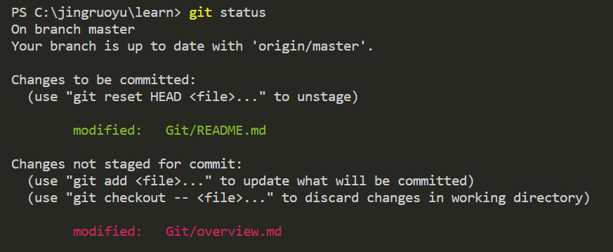

# 起步

## 版本控制

版本控制是一种记录一个或若干文件内容变化，以便将来查阅特定版本修订情况的系统

版本控制系统（VCS）可以对任何类型的文件进行版本控制

### 本地版本控制系统

采用某种简单的数据库，记录文件的历次更新差异进行版本控制

最流行的是RCS，工作原理是在硬盘上保存补丁集，即文件修改前后的变化，通过应用所有的补丁，可以重新计算出各个版本的文件内容。目前MAC OS上还可以使用`rcs`命令

### 集中版本控制系统

为了不同系统上协同工作，集中版本控制系统（Centralized Version Control Systems，简称 CVCS）应运而生

* 优点
  * 相较于本地VCS，同步数据更加容易
  * 可以管理每个开发者的权限，且CVCS的使用比各个客户端上维护本地数据库更加容易
* 缺点
  * 中央处理器单点故障、数据丢失

### 分布式版本控制系统

分布式版本控制系统（Distributed Version Control System，简称 DVCS），客户端并不只是提取最新版本的文件快照，而是把代码仓库完整的景象下来，包括完整的历史记录，任何一处服务器发生故障，之后都可以用镜像出来的本地仓库进行恢复。此类系统如git、Mercurial等

## git简史

Linux内核开源项目的维护者们很多工作都花在了版本相关的事物上，2002年开始，项目组开始启用专门的DVCS系统BitKeeper进行代码的管理和维护

后期Linux开源社区开始基于BitKeeper开发自己的版本系统，目标为
* 速度
* 简单的设计
* 对非线性开发模式的强力支持（允许大量并行开发的分支）
* 完全分布式
* 对超大数据量的支持

Git由此诞生

## git基础

### 保存快照

CVS、SVN等以文件变更列表的形式存储信息，将他们保存的信息看作是一组基本文件和每个文件随时间逐步积累的差异，**即存储每个文件与初始版本的差异**

**Git保存文件系统的一组快照**。Git主要对当时的全部文件制作一个快照，并保存这个快照的索引。如果文件没有修改，则不会重新存储该文件，而是保留一个链接指向之前存储的文件。

**Git对待数据更像是快照流**

Git更像是一个小型的文件系统，提供了许多以此为基础构建的超强工具

### 本地执行

git绝大多数操作只需要访问本地文件和资源，本地数据库中存储项目的完整历史，无需与服务器交互，加快速度，相较于其他CVCS更方便

### 完整性

git中所有数据在存储前都计算校验和，然后用校验和进行引用，故不可能在Git不知情时更改任何文件内容或目录内容。此功能位于Git底层

Git用于计算校验和的机制叫做SHA-1散列，即hash，是40个16进制字符组成的字符串，基于Git中文件的内容或目录结构计算而来

Git数据库中保存的信息都是以文件内容的哈希值来索引，而不是文件名

### 一般只添加数据

Git操作一般只添加数据，很难清除其中的数据

Git保存及恢复丢失数据的原理详见**撤销操作**

### **三种状态**

Git中文件存在三种状态
* committed：已提交，数据已经安全保存在本地数据库中
* modified：已修改，修改了文件，但尚未保存到数据库中
* staged：已暂存，对一个已修改文件的当前版本做了标记，使之包含在下次提交的快照中

git中存在三个工作区域
* git仓库：保存项目元数据和对象数据库的位置，其他技术局clone repo时，clone的就是这里的数据
* 工作目录：对项目某个的版本独立提取出来的内容，可以使用或修改
* 暂存区域：保存了下次将要提交的文件列表信息

基本的Git 工作流程为
* 在工作目录中修改文件
* 修改提交到暂存区，文件快照放入暂存区域
* 提交更新，找到暂存区域的文件，将快照永久性存储到Git仓库目录