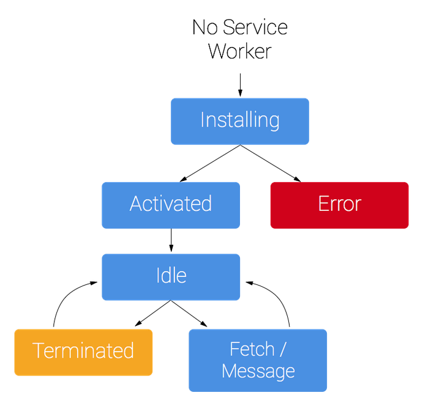

## service worker 

[service workers](https://developer.mozilla.org/zh-CN/docs/Web/API/Service_Worker_API/Using_Service_Workers)

### 特点

* install之后会一直运行，且会自动更新
* 只能在HTTPS中运行，可以进行资源缓存
* 可以通过postMessage传递消息
* 不能操作DOM
* 单独线程运行，不会被阻塞，也不阻塞其他js，适用于复杂计算

### 过程

1. 注册

	此过程一般在主函数中进行，需要进行属性检测。注册时需要指定service worker文件位置，可以同时指定此worker的管理范围

2. 安装

	注册后，浏览器会尝试安装并激活，故install事件会在安装完成后触发，此事件可以被监听

	`install`事件一般是被用来填充你的浏览器的离线缓存能力，此处需要使用`cachestorage`的API `caches`，根据指定的key存储网络请求资源。此缓存会一直持久存在，直至手动删除

	* **整个缓存过程需要在安装完成之前完成**，所以用到waitUtil方法。可以在第一个fetch事件之前完成所有缓存
	* `localStorage`是同步存储，不允许在service worker中使用
	* 可以使用**`IndexDB`**做数据存储

3. 激活

	安装完成后service worker会被激活，`activate`事件可以被监听

	激活一般用户删除旧缓存。当需要缓存更新时，通过key的白名单，删除旧缓存。

	此过程也使用`waitUtil`，可以在第一个fetch事件前完成清理操作

4. fetch事件

	通过捕捉控制scope范围内的fetch事件，service worker可以实现对所有请求的控制

	捕获fetch事件后，使用`event.respondWith`可以劫持HTTP响应，完成各种操作，详见[service workers](https://developer.mozilla.org/zh-CN/docs/Web/API/Service_Worker_API/Using_Service_Workers#%E8%87%AA%E5%AE%9A%E4%B9%89%E8%AF%B7%E6%B1%82%E7%9A%84%E5%93%8D%E5%BA%94)

5. 更新

	如果你的 service worker 已经被安装，但是刷新页面时有一个新版本的可用，此时

	* 新版会在后台安装，但是还没激活。
	* 当不再有任何已加载的页面在使用旧版的时候，新版本才会激活。

	注意此过程中
	* service worker的文件名不能发生变化，否则无法发现版本更新
	* 注册的service worker名称不能发生变化，有人会在名称后面跟时间戳以实时监测sw文件更新得到最新缓存，但会导致每次都注册新的service worker，系统负担很大，得不偿失。

	正确监测sw文件更新两种方法：
	* 服务端配置sw.js为no-cache不缓存，每次更新单独请求，此方法需要单独服务端配置
	* 将注册过程单独写入js文件，在主文件中每次带上时间戳请求最新的该文件。

		在注册文件中，注册时带上上线版本号，保证每上线一次，会且只会重新注册一个新的sw，立即完成新文件缓存

	详见：[service worker更新](https://zoumiaojiang.com/article/how-regist-service-worker-for-pwa/)

	**新旧版之间可以通过key区分cache，注意旧cache的删除**

## Q&A

1. 不同路径下注册

	Q：`/a`路径下能否注册根路径下的`service worker`

	A：可以，注册之后访问根路径时该`service worker`也会使用，此时资源来源为`from disk cache`。**不过要注意对不同路径所需资源的支持**，此处需要缓存文件列表与fetch请求监听的共同支持，尤其是在单页面应用上，vuerouter的history模式下不同路径会访问同一份资源

2. 断网`unregister`后不同路径下的不同表现

	Q：断网情况下，`unregister`掉`/a`路径注册在根路径下的`service worker`，此时再刷新页面a的确无法访问。但是转而访问根路径页面可以访问，观察到一个新的worker被重新注册并获取资源，何处注册，何处拿到资源？

	A：在devtools的network中可以发现，断网`unregister`后页面来源为`from disk cache`，故页面资源从硬盘缓存中获取，并在其中注册

3. 单页面应用history模式下拦截其他路径下请求

	Q：vuerouter的history模式下，使用path区分不同页面的路径，本质仍为单页面，需要服务器做相应配置，在不同路径下返回同一份html文件，此时HTTP缓存位于不同路径下。当无网络时访问一个全新路径，由于没有该path缓存，页面会访问失败，可以使用service worker返回相关资源

	A：在service中具体做法类似于服务端的配置，对特定路径下的html资源访问均从缓存中匹配主文件或发起根路径资源请求，如下示

		if (event.request.url.indexOf('/b') > 0) {
            // return fetch('/');
            return caches.match('/');
        }

    此种方法即可解决SPA应用不同路径下缓存不同问题