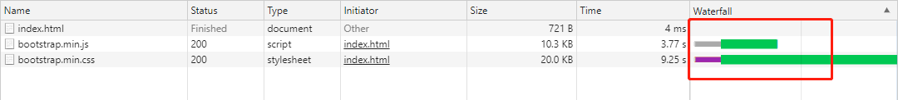

# 高性能JavaScript

解释性代码天生就没有编译行代码块，因为解释性代码必须经历把代码转换为计算机指令的过程，存在性能损耗，而编译器可以根据词法分析判断代码想实现什么，然后产生出能完成任务的运行最快的机器码来进行优化，解释性代码基本上是代码怎么写，就会怎么执行

## 第一章 加载和执行

1. js文件下载过程不会阻塞其他文件，但是解析过程会阻塞

    这一点文中及很多博客都表述不正确

    

    拓展：CSS解析时会阻塞DOM解析

2. script标签合并，将数个资源请求合并，减少HTTP次数
3. defer与async区别
    * 无：立即加载并执行脚本，执行时阻塞
    * defer：资源加载后，在DOMContentLoaded事件触发后执行，多个defer按照加载顺序执行
    * async：脚本加载完后立即执行，乱序执行

    

4. 先加载必须项，再加载非必须项，且放置到body尾部，防止阻塞body解析