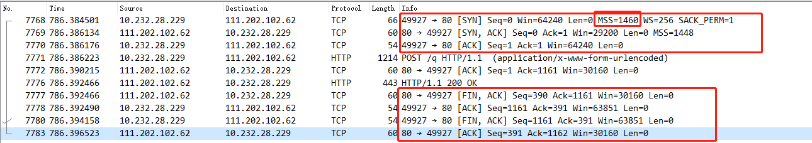
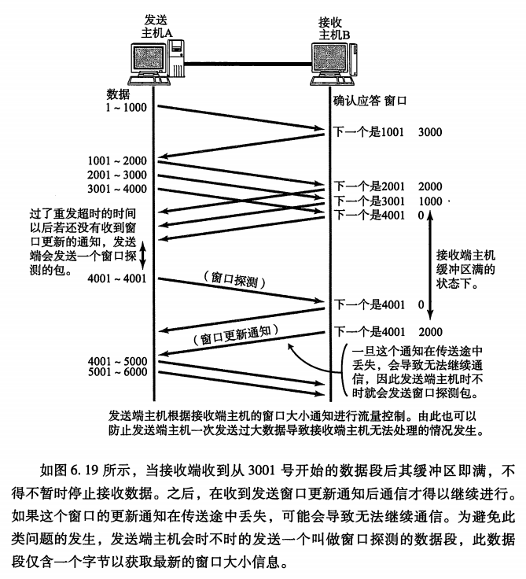

## TCP与UDP

### 6.1 传输层的作用

* TCP面向连接，可靠地流协议，提供可靠地通信传输
* UDP面向无连接的，提供不可靠的通信传输，常用于广播和细节控制交给应用的服务

传输层使用端口号区分应用层中所要进行处理的具体程序

在传统的C/S框架下，服务端会启动一个超级守护进程，即互联网守护进程inetd，该进程在接收到客户端请求后会根据目标端口号fork新的进程并转换为所需的各个服务端程序，也称守护进程

TCP与UDP需要根据需求进行相应选择

**套接字Socket**

操作系统提供了很多类库，即API，应用在使用TCP或UDP通信时，会广泛使用到套接字(socket)的API，使用其可以设置对端的IP地址、端口号，并实现数据的发送与接收

### 6.2 端口号

* MAC地址用于识别同一个数据链路中不同的主机
* IP地址用于识别TCP/IP网络中互连的主机和路由器
* 端口号用于识别同一台计算机中进行通信的不同应用程序，也称程序地址

**通过源IP地址、目标IP地址、源端口号、目标端口号与协议号五个信息识别是否为一个通信**，只要其中某一项不同，则被认为是其他通信

#### 6.2.4 端口号如何确定

* 标准既定的端口号

	每一个应用程序都有其指定的端口号，但是不可以随意使用任何一个端口号，每个端口号都有其对应的使用目的

	知名端口号：部分广泛使用的应用协议所使用的端口号是固定的，其被称为知名端口号，应用程序应该避免使用知名端口号进行既定目的之外的通信，避免冲突。

* 时序分配法

	也称动态分配法，客户端应用程序不用设置端口号，交由操作系统分配。操作系统为每个应用程序分配互不冲突的端口号，对端口号进行动态管理。

#### 6.2.5 端口号与协议

端口号由其使用的传输层协议决定，不同的传输层协议可以使用相同的端口号，但是使用目的各不相同，端口号上的处理是根据每个传输协议的不同进行处理的，互相独立不受影响。

知名端口号与传输层协议并无关系，只要端口号一致都将分配同一种程序进行处理。如TCP和UDP都使用53号端口进行DNS服务

### 6.3 UDP

UDP：User Datagram Protocol，不提供复杂的控制机制，利用IP提供**面向无连接通信服务**，并且将应用程序发来的数据在收到的那一刻，立刻按照原样发送到网络上的一种机制。

UDP无法进行拥塞控制，无法处理丢包，不负责重发，包顺序错乱无法纠正，只提供传输层协议最基本功能，细节控制需要交由应用程序。

UDP面向无连接，可以随时发送数据，简单高效，应用场景：
* 包总量较少的通信（DNS、SNMP等）
* 视频、音频等即时通信
* 限定于LAN等特定网络中的应用通信
* 广播通信（广播、多播）

### 6.4 TCP

TCP：充分实现数据传输时各种控制功能，**面向有连接协议**，只在确认通信对端存在时才发送数据，避免流量浪费，在面向无连接的IP层基础上实现高可靠通信

**连接**：各种设备、线路、网络中进行通信的两个应用程序为了相互传递消息而专有的、虚拟的通信线路。一旦建立连接，应用程序间只使用该虚拟线路进行通信，不必考虑IP网络可能存在的各种问题。

TCP负责控制连接的建立、断开、保持等管理工作

TCP可靠传输依赖于：检验和、序列号、确认应答、重发控制、连接管理以及窗口控制等机制

#### 6.4.2 序列号与确认应答

发送端主机数据到达接收端，接收端主机会返回一个ACK确认应答。
* 如果发送端收到确认应答，说明数据成功到达对端
* 如果一段时间没有收到，可能发生数据丢包或ACK丢包，发送端都会认为数据已丢失，进行重发

#### 6.4.4 连接管理

TCP面向有连接，需要在数据通信开始之前先做好通信两端之间的准备工作。

TCP中一个连接的建立需要经过三次握手，断开需要经过四次分手

三次握手与四次分手如下图示

#### 6.4.5 TCP以段为单位发送数据

MSS：最大消息长度，TCP在建立连接时，同时确定发送数据包的单位。在后续传送中，以MSS的大小对数据分割发送

* 理想的情况是最大消息长度正好是IP中不会被分片处理的最大数据长度
* 以太网最大传输单元MTU为1500字节，对应MSS为1460（除去IP首部20字节和TCP首部20字节）

确定方法：
* 在三次握手建立连接的SYN包相互通知对方网络接口的MSS值
* 在两者中选一个较小的作为MSS的值，发送数据

#### 6.4.6 利用窗口控制提高速度

解决问题：每发送一个段进行一次确认应答，然后再发送下一个段，包往返时间影响通信性能

**引入窗口：使用滑动窗口的方式并行发送**
* 窗口大小：无需等待确认应答而可以继续发送数据的最大值
* 窗口内的数据即使没有收到确认应答也可以被发送出去
* 需要缓存窗口内数据，直到收到它们的确认应答，否则需要对丢包数据进行重传
* 数据发出后若如期收到确认应答就可以不用再进行重发，此时数据就可从缓存区清除
* 收到确认应答后，将窗口滑动到确认应答中的序列号位置

**滑动窗口与重发机制**
* 窗口在一定程度较大时，即使有少部分的确认应答丢失也不会进行数据重发。可以通过下一个确认应答进行确认
* 接收端在没有收到自己所期望序号的数据时，会对之前收到的数据进行确认应答，发送端则一旦收到某个确认应答后，又连续3次收到同样的确认应答，则认为该数据段已经丢失，需要进行重发

#### 6.4.8 流控制

* 让发送端根据接收端的实际能力控制发送的数据量
* 接收端主机向发送端主机通知自己可以接收数据的大小（接收窗口：rwnd，receiver window，能保存数据的缓冲区的大小），发送端发送不超过这个限度的数据。该大小限度即窗口大小
* 在每个TCP连接的整个生命周期中，每个ACK分组都会携带相应的最新rwnd值，以便两端动态调整数据流速
* 由于TCP首部中表示Window Size的字段只有16位，因此按照协议，能表示的最大窗口大小是2^16-1=65535Bytes(64Kb)。采用TCP窗口缩放（TCP Window Scaling），窗口的最大值可以扩展到1G字节

当接收端将发送窗口限制为0时，发送端会暂停发送数据
* 之后收到接收端发送的发送窗口更新通知才会继续发送数据。
* 为避免发送窗口更新通知丢失导致无法继续通信，期间发送端主机会不时向接收端发送窗口探测请求，获取最新窗口大小信息