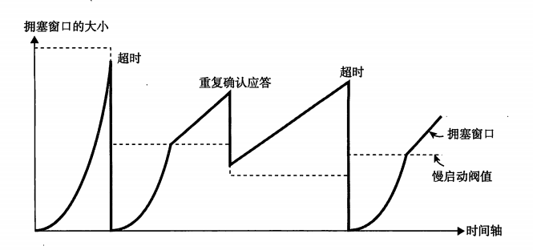

## TCP与UDP

### 6.1 传输层的作用

* TCP面向连接，可靠地流协议，提供可靠地通信传输
* UDP面向无连接的，提供不可靠的通信传输，常用于广播和细节控制交给应用的服务

传输层使用端口号区分应用层中所要进行处理的具体程序

在传统的C/S框架下，服务端会启动一个超级守护进程，即互联网守护进程inetd，该进程在接收到客户端请求后会根据目标端口号fork新的进程并转换为所需的各个服务端程序，也称守护进程

TCP与UDP需要根据需求进行相应选择

**套接字Socket**

操作系统提供了很多类库，即API，应用在使用TCP或UDP通信时，会广泛使用到套接字(socket)的API，使用其可以设置对端的IP地址、端口号，并实现数据的发送与接收

### 6.2 端口号

* MAC地址用于识别同一个数据链路中不同的主机
* IP地址用于识别TCP/IP网络中互连的主机和路由器
* 端口号用于识别同一台计算机中进行通信的不同应用程序，也称程序地址

**通过源IP地址、目标IP地址、源端口号、目标端口号与协议号五个信息识别是否为一个通信**，只要其中某一项不同，则被认为是其他通信

#### 6.2.4 端口号如何确定

* 标准既定的端口号

	每一个应用程序都有其指定的端口号，但是不可以随意使用任何一个端口号，每个端口号都有其对应的使用目的

	知名端口号：部分广泛使用的应用协议所使用的端口号是固定的，其被称为知名端口号，应用程序应该避免使用知名端口号进行既定目的之外的通信，避免冲突。

* 时序分配法

	也称动态分配法，客户端应用程序不用设置端口号，交由操作系统分配。操作系统为每个应用程序分配互不冲突的端口号，对端口号进行动态管理。

#### 6.2.5 端口号与协议

端口号由其使用的传输层协议决定，不同的传输层协议可以使用相同的端口号，但是使用目的各不相同，端口号上的处理是根据每个传输协议的不同进行处理的，互相独立不受影响。

知名端口号与传输层协议并无关系，只要端口号一致都将分配同一种程序进行处理。如TCP和UDP都使用53号端口进行DNS服务

### 6.3 UDP

UDP：User Datagram Protocol，不提供复杂的控制机制，利用IP提供**面向无连接通信服务**，并且将应用程序发来的数据在收到的那一刻，立刻按照原样发送到网络上的一种机制。

UDP无法进行拥塞控制，无法处理丢包，不负责重发，包顺序错乱无法纠正，只提供传输层协议最基本功能，细节控制需要交由应用程序。

UDP面向无连接，可以随时发送数据，简单高效，应用场景：
* 包总量较少的通信（DNS、SNMP等）
* 视频、音频等即时通信
* 限定于LAN等特定网络中的应用通信
* 广播通信（广播、多播）

### 6.4 TCP

TCP：充分实现数据传输时各种控制功能，**面向有连接协议**，只在确认通信对端存在时才发送数据，避免流量浪费，在面向无连接的IP层基础上实现高可靠通信

**连接**：各种设备、线路、网络中进行通信的两个应用程序为了相互传递消息而专有的、虚拟的通信线路。一旦建立连接，应用程序间只使用该虚拟线路进行通信，不必考虑IP网络可能存在的各种问题。

TCP负责控制连接的建立、断开、保持等管理工作

TCP可靠传输依赖于：检验和、序列号、确认应答、重发控制、连接管理以及窗口控制等机制

#### 6.4.2 序列号与确认应答

发送端主机数据到达接收端，接收端主机会返回一个ACK确认应答。
* 如果发送端收到确认应答，说明数据成功到达对端
* 如果一段时间没有收到，可能发生数据丢包或ACK丢包，发送端都会认为数据已丢失，进行重发

#### 6.4.3 重发超时时间

重发超时指重发数据前，等待确认应答到来的特定时间间隔。超过此时间仍未收到确认应答，发送端将进行数据重发

考虑到数据包经过不同线路耗时不同，TCP在每次发包时都会计算**往返时间RTT**及其偏差，将往返时间和偏差相加，重发超时略大于此值，以节省网络流量

Unix和window系统中，超时均已0.5s作为单位进行控制，最初的超时时间一般设置为6s

若重发后仍未收到ACK，则再次进行发送，此时等待确认应答的时间将指数倍延长。到达一定重发次数后，如果仍没有任何确认应答返回，会判断网络或对端主机异常，强制关闭连接，并通知应用通信异常强行终止

#### 6.4.4 连接管理

TCP面向有连接，需要在数据通信开始之前先做好通信两端之间的准备工作。

TCP中一个连接的建立需要经过三次握手，断开需要经过四次分手

三次握手与四次分手如下图示

#### 6.4.5 TCP以段为单位发送数据

MSS：最大消息长度，TCP在建立连接时，同时确定发送数据包的单位。在后续传送中，以MSS的大小对数据分割发送

* 理想的情况是最大消息长度正好是IP中不会被分片处理的最大数据长度
* 以太网最大传输单元MTU为1500字节，对应MSS为1460（除去IP首部20字节和TCP首部20字节）

确定方法：
* 在三次握手建立连接的SYN包相互通知对方网络接口的MSS值
* 在两者中选一个较小的作为MSS的值，发送数据

#### 6.4.6 利用窗口控制提高速度

解决问题：每发送一个段进行一次确认应答，然后再发送下一个段，包往返时间影响通信性能

**引入窗口：使用滑动窗口的方式并行发送**
* 窗口大小：无需等待确认应答而可以继续发送数据的最大值
* 窗口内的数据即使没有收到确认应答也可以被发送出去
* 需要缓存窗口内数据，直到收到它们的确认应答，否则需要对丢包数据进行重传
* 数据发出后若如期收到确认应答就可以不用再进行重发，此时数据就可从缓存区清除
* 收到确认应答后，将窗口滑动到确认应答中的序列号位置

**滑动窗口与重发机制**
* 窗口在一定程度较大时，即使有少部分的确认应答丢失也不会进行数据重发。可以通过下一个确认应答进行确认
* 接收端在没有收到自己所期望序号的数据时，会对之前收到的数据进行确认应答，发送端则一旦收到某个确认应答后，又连续3次收到同样的确认应答，则认为该数据段已经丢失，需要进行重发

#### 6.4.8 流控制

* 让发送端根据接收端的实际能力控制发送的数据量
* 接收端主机向发送端主机通知自己可以接收数据的大小（接收窗口：rwnd，receiver window，能保存数据的缓冲区的大小），发送端发送不超过这个限度的数据。该大小限度即窗口大小
* 在每个TCP连接的整个生命周期中，每个ACK分组都会携带相应的最新rwnd值，以便两端动态调整数据流速
* 由于TCP首部中表示Window Size的字段只有16位，因此按照协议，能表示的最大窗口大小是2^16-1=65535Bytes(64Kb)。采用TCP窗口缩放（TCP Window Scaling），窗口的最大值可以扩展到1G字节

当接收端将发送窗口限制为0时，发送端会暂停发送数据
* 之后收到接收端发送的发送窗口更新通知才会继续发送数据。
* 为避免发送窗口更新通知丢失导致无法继续通信，期间发送端主机会不时向接收端发送窗口探测请求，获取最新窗口大小信息

#### 6.4.9 拥塞控制

* 问题：在网络出现拥堵时，如果两个主机开始通信，突然发送大量数据，可能导致网络瘫痪

	流量控制虽然可以防止发送端向接收端过多发送数据，但是在连接建立之初，无法预知可用带宽，因此需要估算机制，并根据网络中不断变化的条件而动态改变速度

* 解决：慢启动、拥塞预防、快速重发和快速恢复

**慢启动**

通信开始通过慢启动算法得出的数值，对发送数据量进行控制，过程如下图

拥塞窗口cwnd(congestion window)：发送端对从客户端接收确认（ACK）之前可以发送数据量的限制
* 慢启动将此值初始化为1个数据段，即1MSS
* 之后每收到一个ACK，拥塞窗口值加1
* 客户端和服务器之间最大可以传输（未经ACK确认的）数据量取rwnd和cwnd变量中的最小值，即wnd = min(rwnd, cwnd\*MSS)
* cwnd不会在发送端与接收端直接交换

2013年，RFC 6928将cwnd提高到10个TCP段（IW10）

拥塞窗口可以有效减少通信开始时连续发包导致的网络拥塞，避免网络拥塞情况的发送

TCP拥塞控制窗口变化的原则是AIMD原则，即加法增大、乘法减小，AI保证效率，MD保证收敛，保证TCP流之间的公平性。一般情况下，窗口越大，越会形成高吞吐量的通信

**拥塞避免**

问题：随着包的往返，拥塞窗口会以指数函数的形式增长，为避免此类情况引入**慢启动阈值**(ssthresh)。TCP开始通信时，没有设置慢启动阈值

当拥塞窗口的值超过慢启动阈值时，每收到一次确认应答，只允许以下面这种比例放大拥塞窗口，SMSS为一个数据段字节数，故cwnd由指数增长变为线性增长：

	new_cwnd = old_cwnd + SMSS*SMSS/old_cwnd

**快速重传**

超时丢包时
* 将ssthresh设置为当时拥塞窗口一半的大小
* cwnd重新置为1MSS
* 重新进入慢启动过程

重复确认应答：要求至少3次的确认应答数据**到达**对方主机后才会触发，相比使用超时重发机制网络拥堵要轻一些
* 将`ssthresh`设置为当时拥塞窗口一半的大小
* 将cwnd窗口设置为`ssthresh`+3个数据段大小
* 重新进入拥塞避免阶段，该过程属于快速恢复。

**快速恢复**

当收到3个重复ACK时进入此阶段

快速恢复阶段算法TCP Reno
* 将cwnd窗口设置为`ssthresh`+3个数据段大小，重传丢失的分组。

	加3原因为收到3个重复ACK，表明有3个“老”的数据包离开了网络

* 再收到重复的ACK时，拥塞窗口增加1
* 当收到一个新的数据包ACK时，把cwnd设置为第一步中的ssthresh的值。

	原因是因为该ACK确认了新的数据，说明从重复ACK时的数据都已收到，退出快速回复状态，重新进入拥塞避免状态

* 存在问题：只针对当前窗口一个包需要重传，无法应对多个包重传情况
* 改进：使用NewReno

	NewReno需要收到该窗口内所有数据包的确认后才会退出快速恢复状态，从而更一步提高吞吐量

参见[博客](https://blog.csdn.net/zhangskd/article/details/7174682)

**队首阻塞**

TCP是按序交付和可靠交付的，如果有分组没能到达接收端，后续分组必须保存在接收端的TCP缓存区，等待丢失分组重发并到达。

这一切发生在TCP层，应用程序对TCP重发和缓存区中排序是分组一无所知，必须等待分组全部到达才能访问数据。在此之前，应用程序只能通过套接字读数据时感觉到延迟交付。这种效应称为TCP的队首（HOL，Head of Line）阻塞。

因此，对于无需按序交付数据或能够处理分组丢失的应用程序，以及对延迟或抖动要求很高的应用程序，最好选择UDP等协议

**优化建议**

大部分情况下，TCP的瓶颈都是延迟，而非带宽

因此针对服务器配置：
* 升级内核版本
* 增加初始拥塞窗口，使得能够在刚开始就能传输较多的数据量
* 慢启动重启，在连接空闲时禁用慢启动可以改善瞬时发送数据的长 TCP 连接的性能
* 窗口缩放：使高延迟连接达到更好的吞吐量
* TCP快速打开(TCP Fast Open，TFO)：允许在第一个SYN中发送应用程序数据

对于应用程序：
* 减少不必要的发送资源
* 缩短传输距离，使用CDN等技术
* 重用TCP连接

#### 6.4.10 提高网络利用率的规范

* Nagle算法

	发送端即使还有应该发送的数据，但如果这部分数据很少的话，则进行延迟发送的一种处理机制。具体来说，就是在以下任一种条件下才发送数据，否则就暂停等待一段时间后再进行数据发送
	* 已发送的数据都已经收到确认应答时
	* 可以发送最大段长度（MSS）的数据时

	缺点在于可能会造成数据延迟，一般关闭

* 延迟确认应答

	问题：如果接收主机每次都立刻回复确认应答，因为刚接收完数据，缓冲区已满，可能会返回一个较小的窗口。发送端接收到小窗口通知后，会以它为上限发送数据，从而降低网络利用率

	因此受到数据后并不立即返回确认应答，而是延迟一段时间
	* 在没有收到2x最大段长度的数据为止不做确认应答（根据操作系统的不同，有时也不论数据大小，只要收到两个包就即刻返回确认应答的情况）
	* 其他情况下，最大延迟0.5s发送确认应答（很多操作系统设置为0.2s）

	不用为每一个数据段都进行一次确认应答。TCP采用滑动窗口，通常可以应答少一些。通常每两个数据段返回一次确认应答

* 捎带应答

	* 根据应用层协议，发送的消息到达对端并处理后，会返回一个回执。
	* 在此类通信中，TCP的确认应答和回执数据可以通过一个包发送，减少收发数据量
	* 需要启动延迟确认应答。以等待应用处理生成返回数据

### 6.5 其他传输层协议

#### UDP-Lite

解决的问题：
* UDP中，如果校验和出错，则收到的包全部丢弃，有些应用不希望这样
* 不能关闭校验和，否则如果是端口号或IP地址被破坏后果严重

机制：
* UDP-Lite提供与UDP几乎相同的功能
* 自定决定计算校验和的范围

#### SCTP

SCTP，Stream Control Transmission Protocol，流传输控制协议，提供数据到达与否相关可靠性检查的传输层协议

* 以消息为单位收发

	TCP中接收端并不知道发送端应用所决定的消息大小，SCTP可以

* 支持多重宿主，指同一台主机具备多种网络的接口

	比如以太网与无线LAN的各自NIC不同，会获取到不同的IP地址。如果以太网切换到无线，TCP会被断开

	但SCTP可以同时管理多个IP使其同时进行通信，因此能够保持通信不中断

* 支持多数据流通信

	TCP中建立多个连接才能通信，SCTP中一个连接就可以

* 可以定义信息的生存期限

	超过生存期限的信息，不会被重发

SCTP主要用于进行通信的应用之间发送众多较小消息的情况。较小的应用消息被称作数据块（Chunk），多个数据块组成一个数据包

#### DCCP

DCCP，Datagram Congestion Control Protocol，数据报拥塞控制协议，辅助UDP实现拥塞控制

* 同UDP，不能提供发送数据的可靠性传输
* 面向连接，具备建立连接与断开连接的处理。在建立和断开连接上具有可靠性
* 能够根据网络拥堵情况进行拥塞控制。可选择两种方式：
	* 类似TCP（TCP-Like）拥塞控制
	* TCP友好升级控制（TCP-Friendly Rate Control）
* 为实现拥塞控制，接收端收到包后返回确认应答（ACK）。该确认应答将被用于判断重发与否

### 6.6 UDP首部格式

### 6.7 TCP首部格式

在TCP与UDP计算校验和时，会使用**伪首部**
* 原因：识别一个通信有五个要素，但是在传输层只知道源端口与目标端口，其他三项在IP首部中，故在验证五项识别码时需要引入伪首部
* 此外IPv6中IP首部没有检验和字段，TCP或UDP通过伪首部，实现对五项识别码的校验，在IP层并不可靠的情况下提供可靠地通信传输

## 总结

* 传输层作用，端口号作用与划分
* UDP面向无连接的协议
* TCP面向连接的协议
	* 连接的管理，三次握手四次分手，同时告知对方MSS值
	* 滑动窗口机制与流控制rwnd
	* 拥塞控制，慢启动、快回落，cwnd计算，滑动窗口取cwnd与rwnd最小值
	* 超时重发与重复确认应答两种情况的不同
	* 针对滑动窗口机制的优化：增大初始cwnd，慢启动重启，窗口缩放等
* 其他传输层协议
	* UDP-Lite自主设置校验和区间
	* SCTP支持多重宿主
	* DCCP辅助UDP实现拥塞控制
* 首部格式，伪首部，五项识别码的使用
