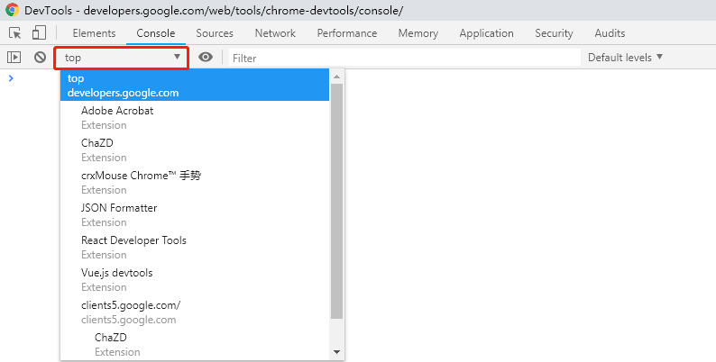

## console

主要功能：

* 查看页面输出，可以定位到相应输出命令代码行
* 运行JavaScript，可以与页面相关或不相关，注意执行环境选择

### 展现形式

* 全屏模式：选择console栏
* 底部导航栏模式：在其他tab下按ESC

### 处理控制台输出

#### 消息展示

* 消息堆叠

	控制台中相同的消息会默认堆叠，并在消息旁显示重复次数

	可以在`setting -> console`中选择`show timestamps`，显示每条消息时还会显示其时间戳，由于时间戳不同，不会出现消息堆叠

* filter过滤

	可以使用字符串或正则过滤控制台消息
	+ `<text>`：仅展示包含该字符串的信息，或者文件名中包含该字符串
	+ `-<text>`：隐藏可以和`<text>`匹配的信息
	+ 正则表达式：仅展示和正则表达式匹配的信息

	也可以在其右侧的level中勾选想要展示的内容
	+ verbose：详细，不勾选会过滤debug信息
	+ Info
	+ Warning
	+ Error

#### 清空历史记录

* 控制台右键`Clear console`
* 控制台调用`clear()`函数
* JavaScript代码中调用`console.clear()`
* `Ctrl + L`

#### 保留历史记录

console的设置项中`preserve log`可以跨页面保留log输出，在页面刷新或更改时不会清空控制台

### 运行JavaScript

#### 选择执行环境

如图示下拉框为`Execution Context Selector`，可以选择控制台的执行环境，在页面中存在iframe时会有很大作用

此选项默认为top，即为页面的顶部框架。其他的框架和扩展程序在其自身环境中运行，执行环境可以通过下拉菜单进行切换。当在top外的环境进行操作时，选择框会突出显示为红色

当选中其他框架的元素时，devtools会将该选项设为对应的环境

### console命令

#### console语句

* `console.log()`：基本记录
* `console.group()` & `console.groupEnd()`：分组输出，可以嵌套

	`console.group()`中可以携带参数，作为该组的title

	`console.group()`可以替换为`console.groupCollapsed()`，会自动折叠该分组信息

* `console.warn()`
* `console.error()`
* `console.assert()`：断言，在第一个参数为false时，显示第二个参数，否则断言失败显示报错
* `console.table(arr1, arr2)`: 将arr1中的对象以表格形式展示出来，arr2可选，内容为希望展示的key

#### 字符串替代与样式控制

* 字符串替代：console函数中第一个参数可能包含一个或多个格式说明符，格式说明符由一个`%`符号与后面紧跟的一个字母组成，字母指示应用到值的格式。字符串后面的参数会按顺序替换占位符，达到字符串替换的效果

		console.log("Node count: %d, and the time is %f.", document.childNodes.length, Date.now());

* 样式控制：console语句的**第二个参数**可以用于设置样式

		console.log("%cThis will be formatted with large, blue text", "color: blue; font-size: x-large");

