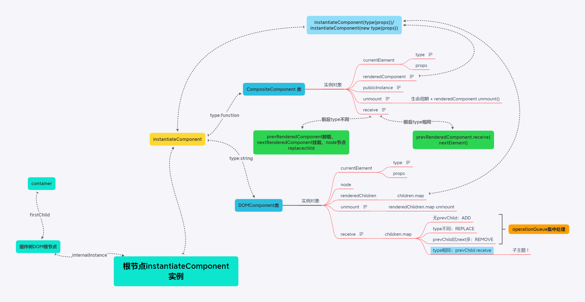

## stack reconciler实现笔记

[stack reconciler实现笔记](https://reactjs.org/docs/implementation-notes.html)

[stack reconciler实现笔记 中文版](https://jobbym.github.io/2017/02/14/react-Implementation-Notes/)

[相关视频](https://www.youtube.com/watch?v=_MAD4Oly9yg)

这篇文章是stack reconcile实现笔记集合

react实例关系图



### stack reconciler 基础

#### reconciler

`React DOM`和`React Native`这样不同的渲染器需要共享很多逻辑，特别的，`diff`算法应该尽可能的一直，以便代码在各个平台上表现如一

为了解决这个问题，不同的渲染器之间需要共享一些代码，我们称其为React中的协调器reconcile。当安排了setState之类的更新时，协调器会在虚拟DOM树上调用组件的render方法，执行挂载、更新或者卸载

协调器没有单独打包，因为目前没有提供公共的API，仅由React DOM和React Native之类的渲染器使用

#### stack reconciler

`stack reconciler`是为React 15及更早的版本提供的支持，目前已经停止使用，替代它的是fiber reconciler，其实质是在stack的基础上进行优化

`stack reconciler`对`render`、`reconciler`（即diff）、DOM的处理方式为，每调用一个`render`生成对应的`element`对象，就进行相应的`reconciler`，然后如果发现子元素发生变动，再对子元素进行相同的递归遍历操作，最终根据生成的`element`对象进行DOM操作。

在此过程中，`render`、`reconciler`的执行即为不断地出栈入栈，故称为`stack reconciler`

#### fiber reconciler

`fiber reconciler`在`stack reconciler`的基础上进行了优化
* 将`render`与`reconciler`的工作变为可中断的，避免过长占用主线程

    `fiber reconciler`会在执行`render`前检查目前为止所有render与reconciler操作耗时，如果超过一定阈值，则让出主线程，避免产生页面无响应的情况

* 能不断地将任务进行优先级排序、rebase和复用
* 能够在父节点和子节点之间来回操作，以支持React中的布局
* 能够从render中返回多个元素
* 更好的支持错误边界

### stack reconciler 原理

#### 概览

reconciler自身没有一个公共的的API，React DOM和React Native中的Renderers使用reconciler，依托用户编写的React Component，有效的更新用户视图

#### mounting是递归过程

首次加载component

	ReactDOM.render(<App />, rootEl)

React DOM将App组件传入reconciler，reconciler判断组件类型。此处的组件即为React element，即为一个对象
* 如果是函数，则调用`App(props)`，获取返回的元素
* 如果是类，则创建一个实例`new APP(props)`，调用生命周期的`componentWillMount`方法，之后调用`render`函数获取已渲染的element

无论是哪种方式，reconciler都会得到App组件的渲染目标"renderered to"

这个过程是递归的，App可能渲染为B组件，B可能渲染为C组件。当reconciler会通过用户定义的component渲染逻辑，向下递归的获取数据

参见博客中伪代码。

**此处重点解释了class组件和函数组件返回的都是一个element对象，该对象上有type、props属性**

**compositeComponent组件的type会是一个对象，指向其渲染函数或者class，可以通过type访问到对应的函数或class，故可以在渲染函数上绑定一些自定义属性，或在class上指定静态属性，这为我们提供了一种数据机制，可以通过此方法进行数据传递，用于识别组件等功能**

**NOTE**
* React element是使用一个简单地对象来表示组件的type和props
* 用户定义的component可以是类或者函数，但它们都会表达成element
* mounting是一个递归过程，通过给定一个React element顶点，可以创建一棵DOM或Native树

#### 挂载元素

如果我们最终没有渲染一些内容到屏幕上，那么这一过程是无效的

除了用户自定义的组件之外，React元素也可以表示特定平台的组件(host组件)，如div等

**当一个元素的type是string时，我们会将其当做一个host组件处理。**当reconciler遇到一个host组件时，它会让渲染器处理加载它。例如，React DOM会创建一个DOM节点

如果host组件有子节点，reconciler会根据上述规则进行递归加载，无论子节点的类型是什么。

子节点生成的DOM节点会被追加到父级DOM节点下，并依次递归，最终生成完整的DOM结构

**NOTE**

reconciler自身不与DOM绑定。元素挂载的准确结果取决于渲染器，在React DOM中是一个DOM节点，React DOM Server中是一个字符串，React Native中是一个代表本地视图的数字

参见博客中伪代码。

**此处重点在于针对host component，以及其中children的处理**，整体上都是在不停的递归调用mount函数以获取组件内部DOM结构，然后使用mountHost生成DOM节点并绑定

#### 内部实例生成过程

React的关键特性是尅重新渲染任何事物，而不必重新创建DOM或者重置状态

之前的介绍中只说到了如何生成初始化的DOM树，但是还不能进行更新，因为没有存储所有的`publicInstances`，并且DOM节点与组件之间也没有对应关系

stack reconciler代码库使用`mount` + class解决这个问题。这种方式存在缺点，我们正在通过fiber reconciler进行替换

之前我们创建了`mountHost`和`mountComposite`两个函数处理element树的解析，这里将会把他们转化为`DOMComponent`和`CompositeComponent`两个class，class的constructor函数接收element对象

伪代码修改：
* mount变为instantiateComponent：改为返回两个类的实例，传入参数依然是element对象
* mountComposite变为CompositeComponent：在返回的实例上拥有以下几个属性
	* currentElement：当前的element对象
	* renderedComponent：instantiateComponent返回的对象，即为CompositeComponent或DOMComponent实例
	* publicInstance：组件实例，只有class组件会有，函数组件为null

		class组件中使用的生命周期方法，都会作为组件实例的方法，通过`publicInstance`即可访问

	mount方法继续调用内层包含块的mount方法

	CompositeComponent是reconciler的实现细节，不会向用户暴露。之前class组件与函数组件的element对象都是直接向用户暴露的

* mountHost变为DOMComponent：在返回的实例上增加以下属性
	* currentElement：当前的element对象
	* node：根节点
	* renderedChildren：每一个子节点的instantiateComponent实例化对象，之后直接mount，然后挂载在node上

	mount方法返回真正的DOM节点

`DOMComponent`和`CompositeComponent`两个class也称为内部实例。当它们存在时，我们可以将一些长期属于与他们联系在一起。只有渲染器renderer和reconciler能够接触到它们

相反，我们称用户定义的类所产生的实例为公共实例。公共实例可以在自定义组件的render函数或其他方法的this上访问到

*注意文档中的举例*，从<App />到div的内部实例树中包含composite与host实例

*React Devtools中，使用灰色高亮host实例，使用紫色高亮composite实例*

组件挂载时，首先实例化整个组件树，之后调用组件根节点的mount方法，就可以层层调用，最终获取到真实的DOM节点，然后添加到DOM树上去

#### 组件卸载

之前已经实现了使用内部实例对象实现element到DOM节点的映射，最终生成了整个DOM树

如果要在组件卸载时实现对应的生命周期方法，需要在DOM节点上存储内部实例对象，以便在组件卸载时访问对应的实例方法

```javascript
function mountTree(element, containerNode) {
  // Destroy any existing tree
  if (containerNode.firstChild) {
    unmountTree(containerNode);
  }

  // Create the top-level internal instance
  var rootComponent = instantiateComponent(element);

  // Mount the top-level component into the container
  var node = rootComponent.mount();
  containerNode.appendChild(node);

  // Save a reference to the internal instance
  node._internalInstance = rootComponent;

  // Return the public instance it provides
  var publicInstance = rootComponent.getPublicInstance();
  return publicInstance;
}
````

以上代码中将内部实例对象`rootComponent`作为`node`的`_internalInstance`内部属性，在组件卸载或其他场景下可以直接通过node节点访问到

class组件中使用的生命周期方法，都是最终生成的组件实例方法，可以通过内部实例对象中`CompositeComponent`实例上的`publicInstance`属性访问到

由此可以在元素卸载时递归调用`componentWillUnmount`生命周期函数

#### updating

之前我们实现了React的卸载方法实现，不过React不会将整个树的每个组件都卸载掉然后重新加载。reconciler的目标是复用已存在的实例，尽可能的保存DOM和state

此部分的实现是通过在`DOMComponent`和`CompositeComponent`中分别增加**receive**方法

```javascript
receive(nextElement) {
	// ...
}
```

此函数作用是通过nextElement提供的描述更新component及其子节点，nextElement是当前组件在下一次渲染中的element对象

这部分常被称为**虚拟DOM比较**（virtual DOM diffing），但是真正发生的是**通过递归遍历内部实例对象树，让每一个实例对象接收更新**

#### 更新composite组件

当composite component收到一个新的element时，会运行实例的componentWillUpdate生命周期钩子

然后会使用新的nextElement中的type、props重新渲染component，得到下一轮待渲染的nextRenderedElement对象。renderElement是组件内容的渲染element

diff操作：
* 若前后两次renderedElement的type相同，会直接使用前一次renderedComponent对象上的receive方法进行更新

    此处需注意，比较的type是组件内容元素的type，即其原对象中renderedComponent上的currentElement与下一次渲染的nextRenderedElement进行对比

    ```javascript
    var prevRenderedComponent = this.renderedComponent;
    var prevRenderedElement = prevRenderedComponent.currentElement;
    // ...
    // 函数组件，类组件不赘述
    nextRenderedElement = type(nextProps);
    // ...
    if (prevRenderedElement.type === nextRenderedElement.type) {
      prevRenderedComponent.receive(nextRenderedElement);
      return;
    }
    ```

    注意renderedComponent与renderElement的不同

* 若前后两次renderedElement的type不同，则需要卸载之前组件，替换元素

    ```javascript
    var prevNode = prevRenderedComponent.getHostNode()

    // Unmount the old child and mount a new child
    prevRenderedComponent.unmount()
    var nextRenderedComponent = instantiateComponent(nextRenderedElement)
    var nextNode = nextRenderedComponent.mount()

    // Replace the reference to the child
    this.renderedComponent = nextRenderedComponent

    // Replace the old node with the new one
    // Note: this is renderer-specific code and
    // ideally should live outside of CompositeComponent
    prevNode.parentNode.replaceChild(nextNode, prevNode)
    ```

    此处需要在两个类中实现一个getHost方法，CompositeComponent中递归调用，DOMComponent返回真实node

总结：当CompositeComponent收到一个新的element时
* 如果type未改变，则代理到自己已渲染的内部实例上，递归比较，最终局部更新
* 如果type改变，则卸载原节点，在这个位置替换一个新元素

本文中暂不讨论带key的情况，此类情况过于复杂

#### 更新host组件

不同平台下的的DOMComponent更新实现是不一样的，当收到一个element时，需要更新底层平台特定的视图。如果是React DOM，意味着需要更新DOM特性，即attributes

```javascript
    // Remove old attribute
    Object.keys(prevProps).forEach(propName => {
      if(propName !== 'children' && !nextProps.hasOwnProperty(propName)){
        node.removeAttribute(propName)
      }
    })
    // Set next attribute
    Object.keys(nextProps).forEach(propName => {
      if(propName !== 'children'){
        node.setAttribute(propName, nextProps[propName])
      }
    })
```

针对children，在更新时进行遍历，根据收到的type是否匹配他们之前的type，判断是更新该子节点还是替换子节点。真实情况下reconciler还需要element的key，并且跟踪插入和删除操作，不过在此不做讨论

我们收集children节点上的DOM操作到一个列表，之后进行批量操作

```javascript
    // 接以上部分
    var prevChildren = prevProps.children || [];
    var nextChildren = nextProps.children || [];

    // These are arrays of internal instances:
    var prevRenderedChildren = this.renderedChildren;
    var nextRenderedChildren = [];

    // As we iterate over children, we will add operations to the array.
    var operationQueue = [];


    for(var i = 0; i < nextChildren.length; i ++){
      // Try to get an existing internal instance for this child
      var prevChild = prevRenderedChildren[i]

      // If there is no internal instance under this index,
      // a child has been appended to the end. Create a new
      // internal instance, mount it, and use its node.
      if(!prevChild){
        var nextChild = instantiateComponent(nextChildren[i])
        var node = nextChild.mount()

        // Record that we need to append a node
        operationQueue.push({type: 'ADD', node})
        nextRenderedChildren.push(nextChild)
        continue
      }

      // We can only update the instance if its element's type matches.
      // For example, <Button size="small" /> can be updated to
      // <Button size="large" /> but not to an <App />
      var canUpdate = prevChildren[i].type === nextChildren[i].type

      // If we can't update an existing instance, we have to unmount it
      // and mount a new one instead of it.
      if(!canUpdate){
        var prevNode = prevChild.node
        prevNode.unmount()

        var nextChild = instantiateComponent(nextChildren[i])
        var nextNode = nextChild.mount()

        // Record that we need to swap the nodes
        operationQueue.push({type: 'REPLACE', prevNode, nextNode})
        nextRenderedChildren.push(nextChild)
        continue
      }

      // If we can update an existing internal instance
      // just let it receive the next element and handle its own update.
      prevChild.receive(nextChildren[i])
      nextRenderedChildren.push(prevChild)
    }

    // Finally, unmount any children that don't exist:
    for(var j = nextChildren.length; j < prevChildren.length; j ++){
      var prevChild = prevRenderedChildren[j]
      var node = prevChild.node
      prevChild.unmount()

      // Record that we need to remove the node
      operationQueue.push({type: 'REMOVE', type node})
    }
    // ...
```

要点：
* operationQueue中收集所有的DOM操作
* 在进行子节点比较时，基本上与compositeComponent相同，不过有三种操作
    * ADD：prev无子节点，next新增
    * REPLACE：prev与next的type不同
    * REMOVE：prev比next子节点多，移除多余的子节点

#### 根节点更新

实现了CompositeComponent与DOMComponent中的receive更新之后，就可以利用type比较进一步实现根节点的更新

```javascript
function mountTree(element, containerNode) {
  // Check for an existing tree
  if (containerNode.firstChild) {
    var prevNode = containerNode.firstChild;
    var prevRootComponent = prevNode._internalInstance;
    var prevElement = prevRootComponent.currentElement;

    // If we can, reuse the existing root component
    if (prevElement.type === element.type) {
      prevRootComponent.receive(element);
      return;
    }

    // Otherwise, unmount the existing tree
    unmountTree(containerNode);
  }

  // ...

}
```

已上代码中，`_internalInstance`中存储的是上一次组件树挂载时`instantiateComponent`返回的component实例，其中包含了currentElement对象，可以与下一次渲染时的element对象进行比较

如此，在重新执行mountTree时，就不会直接卸载原来的组件树，而是先进行type对比
* 如果type相同，直接调用原来根节点实例的receive更新
* 如果type不同，则卸载之前的组件，重新渲染

#### 本文省略的部分

相比真实的代码库，本文省略了一些重要的方面：
* component可以渲染null，reconciler可以处理数组和渲染输出中的empty slots
* reconciler可以读取元素的key，并且使用它在元素和实例之间建立对应关系。实际React实现中的复杂逻辑大都与之相关
* 除了composite和host内部实例类，还有text和empty的component类，他们用于表示文档节点以及渲染为null的空槽位(empty slots)
* `Renderers`使用`injection`去传递host内部实例类到`reconciler`，如`React DOM`通知`reconciler`使用`ReactDOMComponent`作为host内部实例的实现类
* 更新children list的逻辑被提取为mixin，称为`ReactMutiChild`，它在`React DOM`和`React Native`中的host 内部实例类实现
* 在`CompositeComponent`中，`reconciler`页实现了对`setState`的支持。在事件句柄中的多个更新被绑定到一次更新中
* reconciler也会处理绑定和解绑定（attaching and detaching）refs 到`composite component`和`host`节点上。
* DOM准备就绪后调用的生命周期方法，如`componentDidMount`和`componentDidUpdate`，会被收集到`callback queues`中，并一次性全部执行
* React 将关于当前更新的信息放到一个称为事务`tansaction`的内部对象上。事务对于跟踪未执行完的生命周期方法，当前DOM嵌套的警告，任何其他全局范围的更新是很有用的。事务还可以确保React在更新后“清理所有内容”。例如，React DOM提供的事务类在任何更新后都会还原输入选择

react中调用reconciler是一个同步过程，其通过重写一些事件，如click等，将reconciler的调用增加到到真正的click回调函数中。而componentDidUpdate等生命周期方法也是同步调用的，故如果在自定义的click事件中进行异步操作，就可以在这些生命函数执行之后执行，这一点在组件库使用中很有用

### 未来的发展方向

stack reconciler有一些固有的限制，如同步操作、不能中断工作或分块。因此提出了一个技术架构完全不同的Fiber reconciler，将来趋向于使用fiber reconciler代替stack reconciler